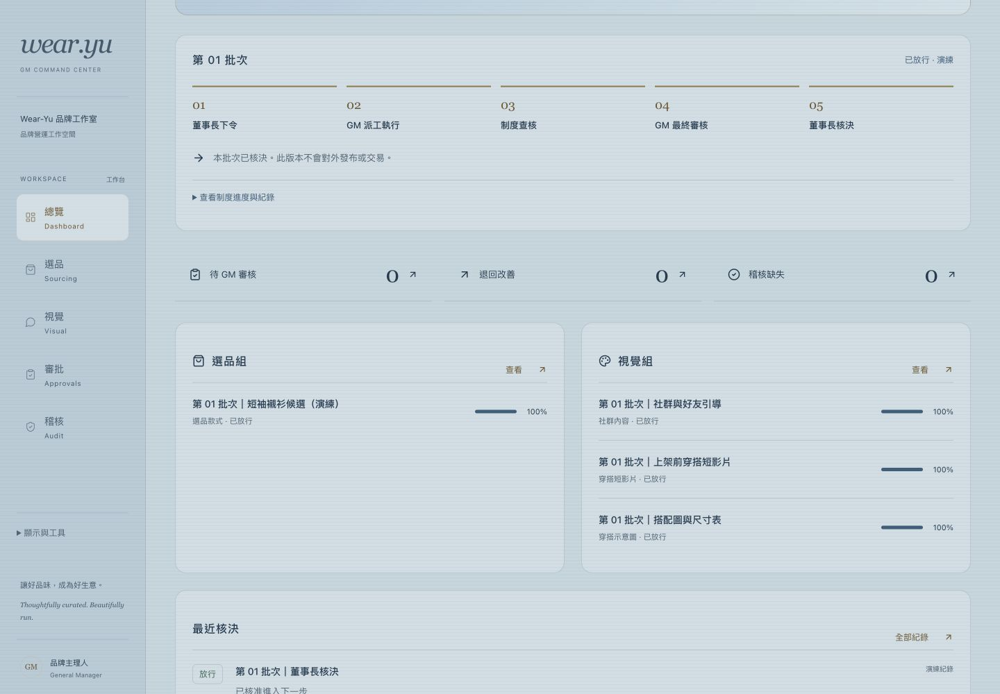
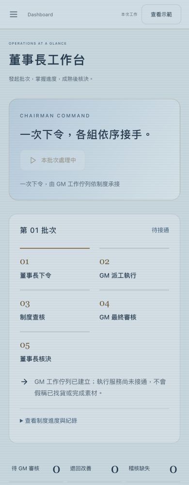

# 董事長批次流程改版

## 實際修改

- 移除選品／視覺人工新增、勾選進度與逐件上呈入口，改由董事長「發起新批次選品」。
- 一次建立 GM 工作佇列與選品、社群、短影片、搭配圖／尺寸表作業；未完成批次不可重複發起。
- 依使用者提供 HTML 制度，呈現五階段與八個控制節點：候選、查重、氣候與短袖、財務、視覺、資安、必要稽核、GM 最終審核。
- 前關完成後才推進後關；GM 放行後才產生董事長核決。退回原因必填，回到 GM 改善，重新完成後續控制再上呈。
- 預設本次工作只建立佇列，顯示「待接通」，不虛構執行結果。明確切換示範後，可自動演練前七關，仍需 GM 與董事長分別核決。
- 保留現有色調，以低透明度單向細線補上背景、側欄、卡片髮絲紋；避免格紋與強反光。

- 同步遠端新增 AGENTS.md：已核准 A／B 商品獨立列示，不回候選池；缺證據明示 OPEN，財務定價 BLOCK。社群例行內容支線與選品並行，僅上架前素材等待前關。
- 財務控制明示驗證採購成本、海外刷卡費、運費及蝦皮費用，淨利率至少 65%；沒有缺值補零或虛構定價。

## 交付異常紀錄

本輪推送期間 GitHub／本機工具自動審核出現逾時；重試後讀取遠端發現新制度提交，原分支更新受到 non-fast-forward 保護拒絕。已保留並合併新制度，重新驗證後提交。影響僅本輪交付等待，未覆蓋遠端，也未宣告當時已部署。

## 驗證

- Production build 通過；11 項測試通過。
- 五個核心頁面 × 320／390／768／1024／1440px，25 組無橫向溢位。
- 真實瀏覽器演練已確認自動推進至 GM、GM 放行後顯示董事長核決、核決後可發起下一批。
- 測試涵蓋真實模式不能被模擬推進、禁止重複批次與提前核決、退回原因、重做控制與稽核缺失阻擋。

## 限制／驗收

前端未接找貨、素材製作、財務、資安或稽核執行服務，因此不是已運作的自主公司。示範完成不是真實 PASS，不會自動抓商品、生成影片、發佈或交易。一般批次如實停在待接通。資料依既有範圍僅本次瀏覽保留，重新整理清除。

功能與 RWD 自檢通過，正式品牌與公司制度驗收仍待主管／GM／董事長確認。一般問題留在 GM 改善流程，未新增外部 Connector 或後端。
