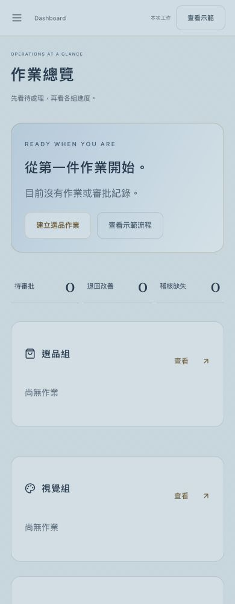
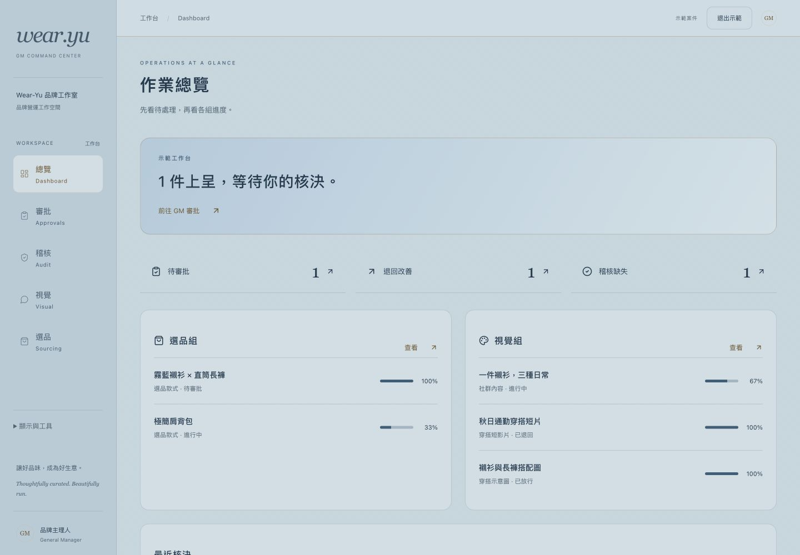
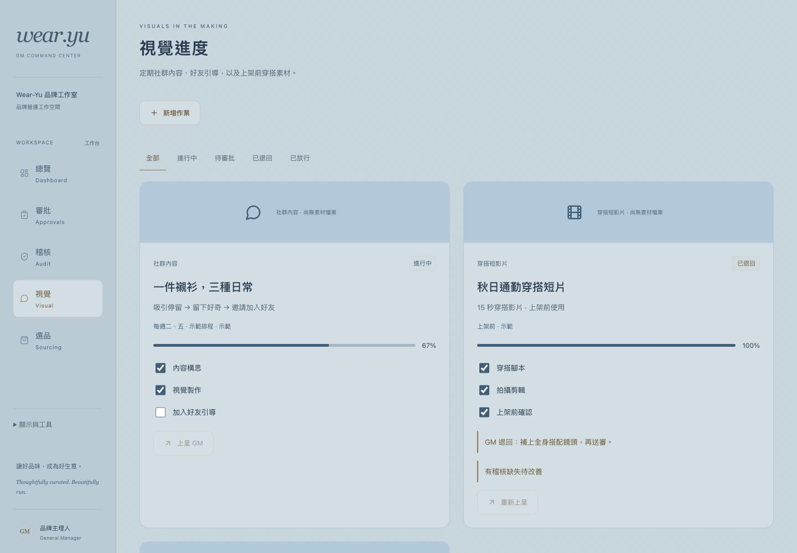

# 作業監控與審批改版

## 實際修改

- 移除營業額、訂單量、新增顧客、營收圖表與業績匯出，以及相應固定資料與舊頁面。
- 總覽改為待審批、退回改善、稽核缺失、各組進度及最近核決。
- 選品顯示款式與樣品／搭配評估；視覺顯示定期社群內容、好友引導、上架前短片與示意圖。
- 可建立作業、勾選完成步驟、上呈 GM。未完成步驟或有未改善稽核缺失時禁止上呈。
- GM 放行／退回均留紀錄，退回原因必填並同步回工作組；稽核可記錄無缺失或缺失及改善狀態。存在缺失不能放行。
- 預設為空工作區。示範需明確切換，與本次工作分離，避免虛構成果。
- 外觀設定及程式工具收合，新增作業／退回原因／查核表單按需出現。

## Build / Test

- `pnpm build` 通過。
- `pnpm test`：10 項通過，涵蓋空狀態、示範隔離、建立作業到放行、退回原因同步、缺失改善重送、乾淨查核與重複核決保護。
- 六頁 × 320、390、768、1024、1440px：30 組無橫向溢位，見 [實際檢查](rwd.json)。
- 真實瀏覽器已確認退回原因同步與 390px 手機選單導覽後收合。

## 實際畫面

## 驗收結果與限制

功能與 RWD 自檢通過；正式資訊主管 → 視覺主管 → 稽核 → GM 驗收待進行。

本階段不含後端，資料僅在本次瀏覽保留；重新整理清除，不是真實跨組多人管理系統。定期時程是作業安排顯示，不會自動發佈或執行查核。媒體尚無檔案時顯示空狀態，不把佔位圖當成已完成素材。
