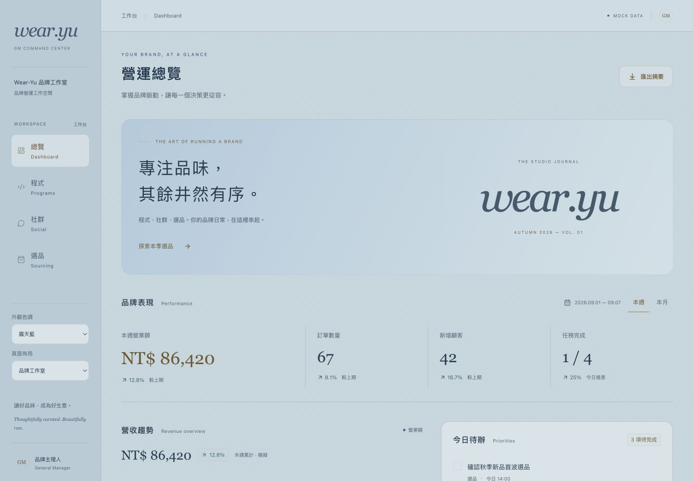
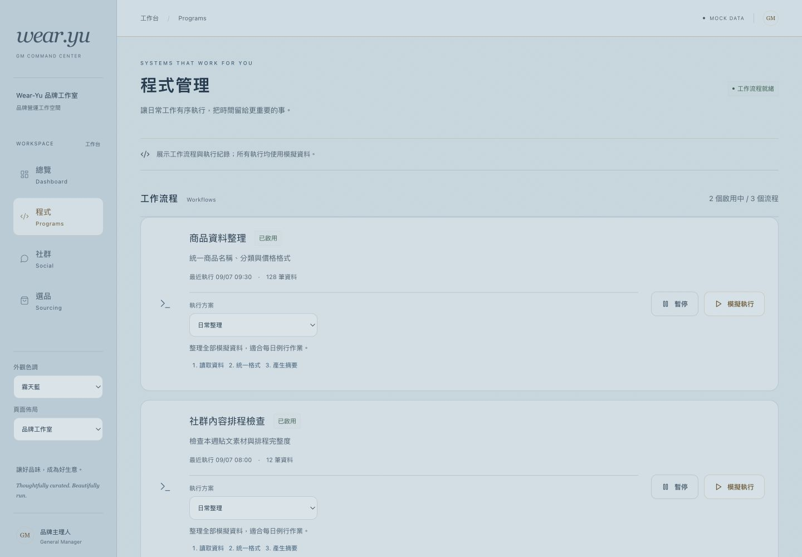
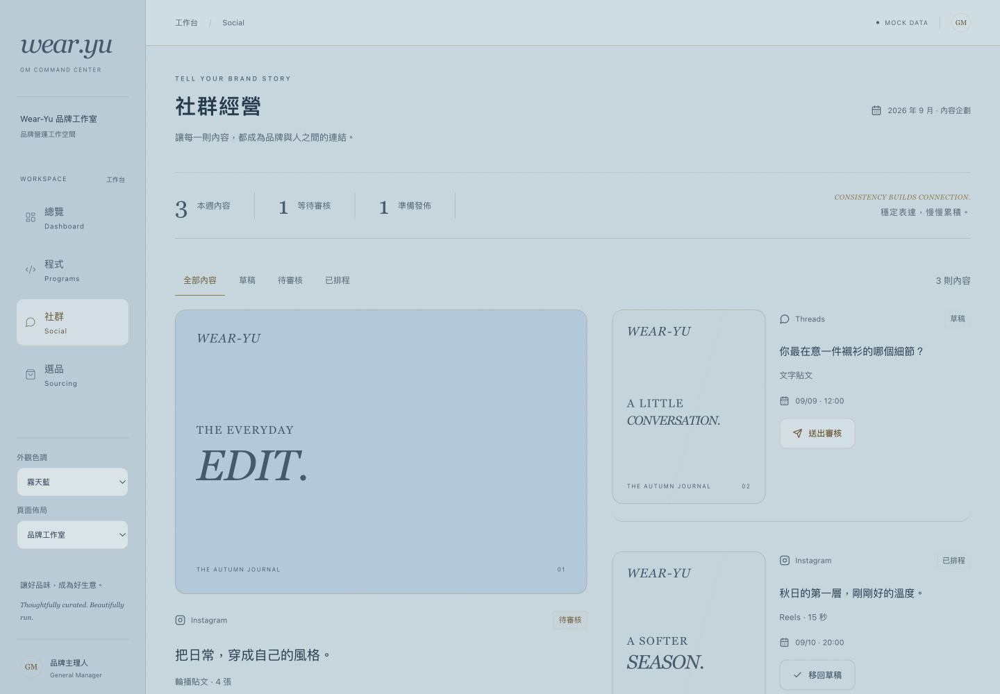
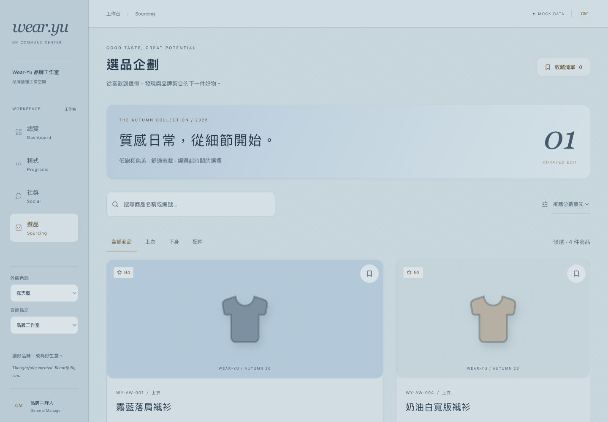
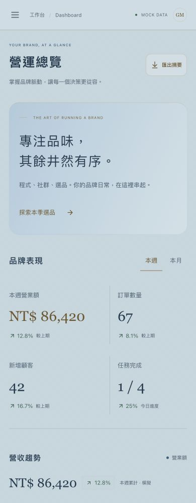
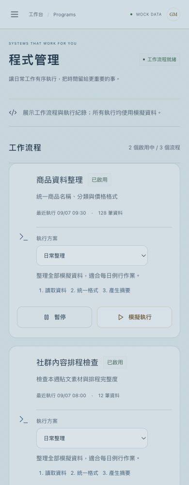
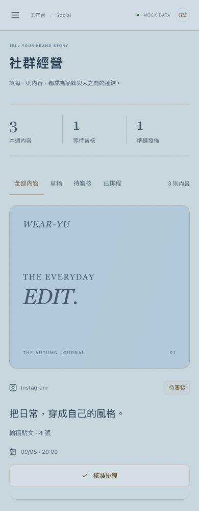
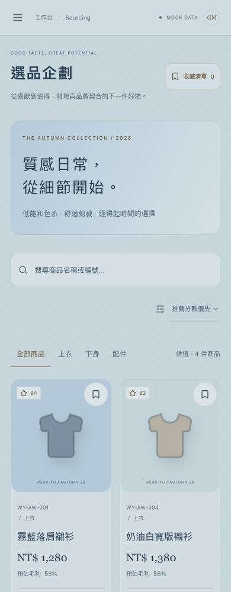
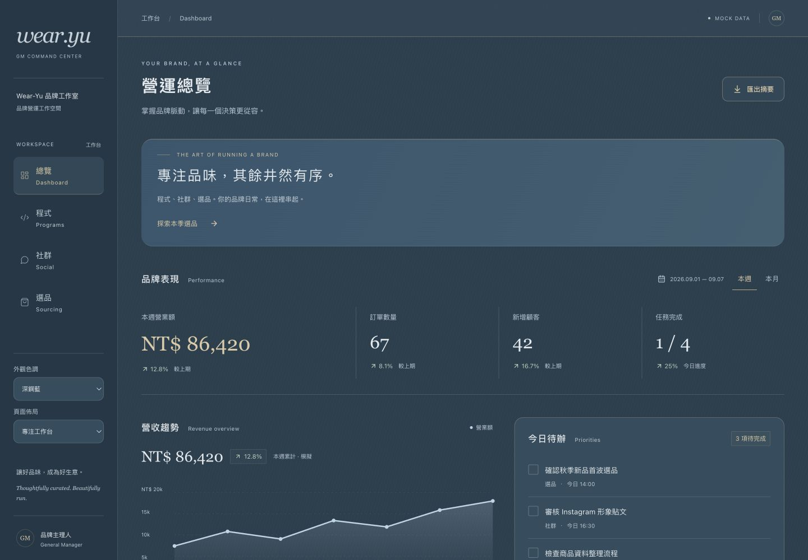

# Sky Luxury 素材優化與方案切換

本次依使用者追加的配色與頁面退回意見實作，不代表已獲正式品牌核准。

## 實際修改

- 依提供 HTML 的天藍、圓角、髮絲紋與細金邊重整四頁；霧天藍主背景 `#c4d5de`，避開素材原本接近白色的亮度。
- 側欄提供霧天藍／深鋼藍切換；共用語意色彩設定涵蓋文字、背景、圖表與商品底色。
- 品牌工作室／專注工作台可切換，專注版縮短主視覺，桌面社群與選品改為方便比較的多欄。
- 工作流程可獨立選擇日常整理或品質複核，顯示 3／4 個步驟，執行紀錄包含所選方案。兩者均為模擬，不對真實資料執行檢查。
- 共用狀態抽離至 hooks，執行方案與 mock adapter 獨立至 domain，避免頁面內耦合日後替換方案。
- 保留 Dashboard、程式、社群、選品與既有互動；沒有串接 Shopee API、資料庫或後端。
- 加入 Vercel 建置設定及 `.vercel` 忽略規則。

## Build / Test

- Production build 通過。
- 10 項測試通過：原核心互動、手機選單、空結果復原，以及外觀與執行方案跨頁保留、暫停流程保護、不同方案結果。
- 兩種色調 × 兩種佈局 × 四頁 × 五個寬度（320、390、768、1024、1440px），80 組實際尺寸檢查無橫向溢位，記錄見 [RWD 檢查](rwd-checks.json)。
- 畫面自檢後修正專注模式標題孤字及淺色商品底色，重新 build/test 通過。

## 實際畫面

下列為 1440×1000／390×1000 viewport 截圖，非完整長頁。

## 驗收與問題

- 功能／RWD 為自檢通過，正式「資訊主管 → 視覺主管 → 稽核 → GM」驗收仍待進行。
- Vercel 尚未部署：指定帳號名稱為 `bojiez77-2506`，連接器未列出團隊；GitHub 登入回覆此信箱已有帳號，需先以 Email 登入後再綁定 GitHub。
- 部署自動審核因尚未確認具體目的地與公開部署授權而拒絕；需完成登入、確認專案及授權後才能上線。
- mock 資料與外觀選擇重整後回復初始值，商品仍為 SVG 示意；本次未新增持久化或外部服務。
