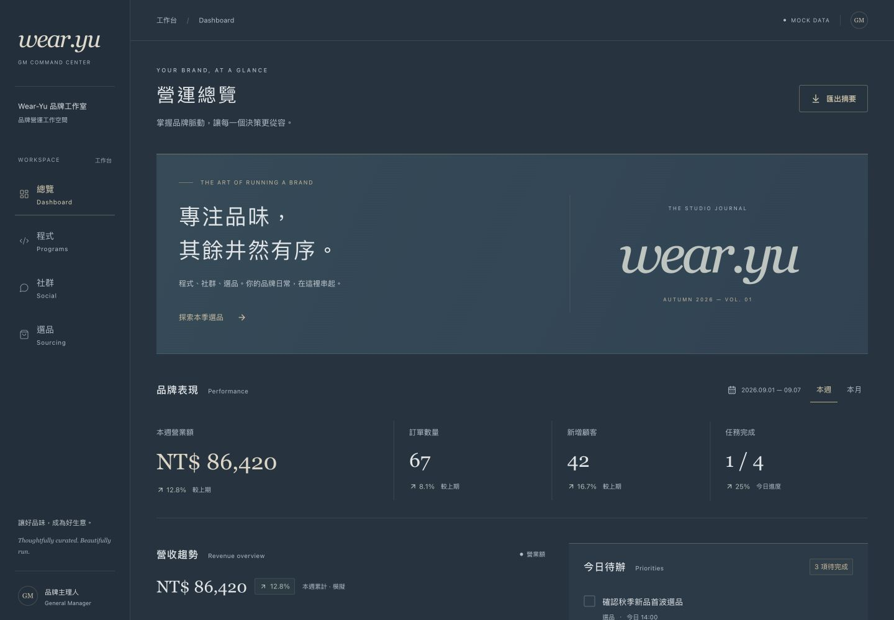
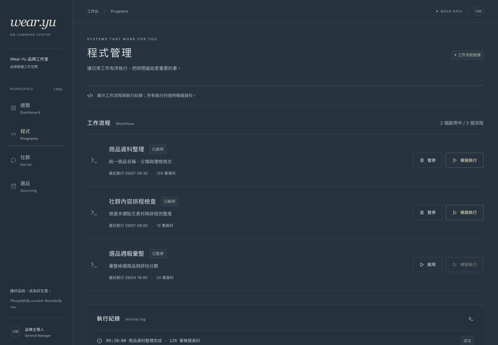
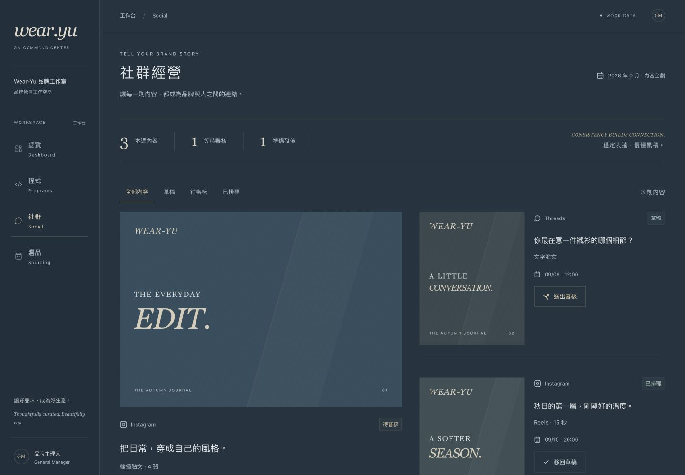
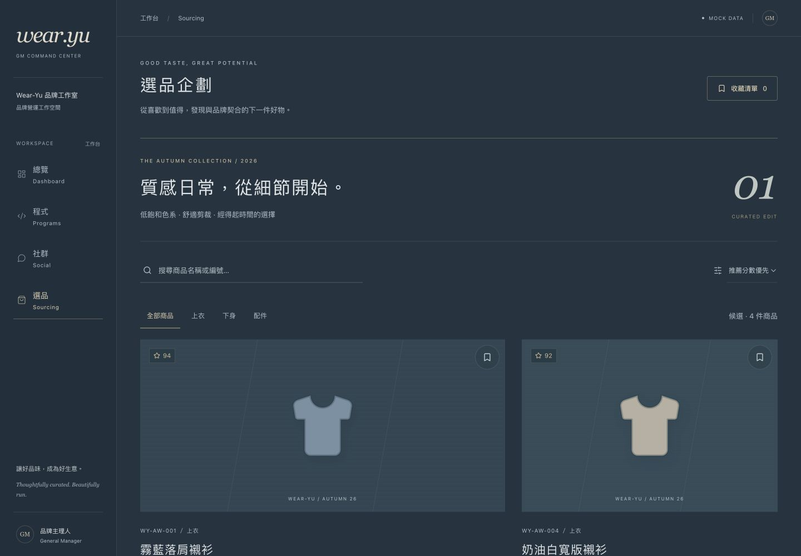
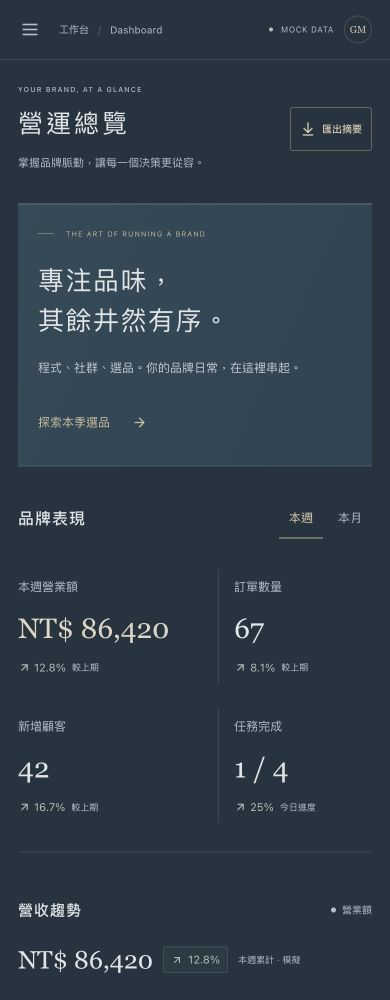
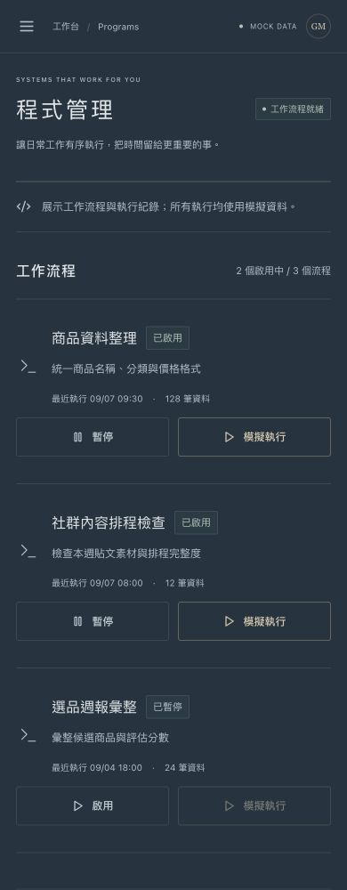
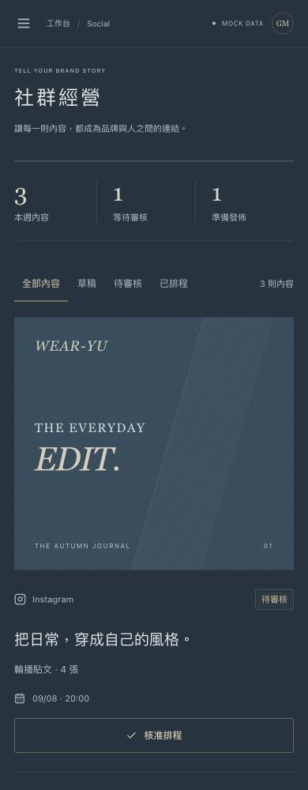
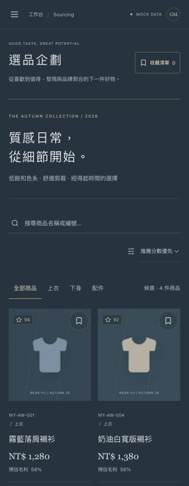

# Wear-Yu 第一批次 UI/UX 優化｜第一輪成果

本輪是實作與自檢成果，尚未取得資訊主管、視覺主管、稽核或 GM 的正式核准。功能通過不等於品牌驗收通過。

## 實際修改

- 重寫全站樣式：主背景 `#233441`、側欄 `#1f303d`、霧面藍面板 `#2b4050`、克制金色 `#bcaa86`。降低反光，不使用光暈或霓虹。
- 品牌改為 `wear.yu` 字標、精簡側欄、底線式選中狀態；移除無操作意義的面板收合圖示。
- Dashboard：移除軌道裝飾、四等分框線卡片及模組卡片矩陣，改成品牌主視覺、分隔式指標、非等寬資訊區與編號工作索引。
- 程式：工作流程採有留白的分隔列，執行紀錄獨立分區，保留暫停、啟用與模擬執行。
- 社群：主內容加兩個次要內容的編輯式排版；窄螢幕自動轉雙欄／單欄；篩選結果維持可讀佈局。
- 選品：桌面採 7:5／5:7 比例，手機保留雙欄。增大商品名稱及價格，降低卡片外框存在感。
- 增大主要資訊字級及操作目標，重新調整留白。修正 Dashboard 與選品標題落單字，以語意分行。
- 四頁核心功能、mock data、記憶體內狀態與 RWD 保留；沒有新增 Shopee API、資料庫或後端。

## 參考來源與範圍

參考使用者提供的 `wear_yu_ops_command_center_v2_sky_luxury.html`。檔案主色接近白色，但本輪明確指令要求低亮度霧面鋼藍／天藍，因此採使用者文字規格。參考檔中的 Gate、董事長決策、Slack、候選條件等內容未視為新增需求。

## Build / Test 與驗證

- `pnpm build`：TypeScript 與 production build 通過。
- `pnpm test`：5 項互動流程測試通過，涵蓋週／月切換、待辦跨頁狀態、流程模擬執行、社群審核、搜尋排序收藏與未知路由。
- 四頁各於 320、390、768、1024、1440px 檢查：20 組無橫向溢位、無 Vite error overlay。
- 真實手機尺寸導航：可開啟、切換選品頁後收合。
- 瀏覽器 error logs：未發現錯誤。
- 畫面證據為 390×1000 與 1440×1000 的實際瀏覽器 viewport 截圖。截圖僅代表當前可視範圍，不是完整長頁。

## 依序驗收狀態

| 階段 | 目前狀態 | 證據／待確認 |
| --- | --- | --- |
| 資訊主管 | 待正式驗收 | build、5 項互動測試、20 組 RWD 自檢通過 |
| 視覺主管 | 待前關通過後驗收 | 下方四頁桌面與手機實際畫面；需核對品牌方向 |
| 稽核 | 待前關通過後驗收 | 確認非模板化、配色、質感、RWD、範圍限制 |
| GM | 待前三關通過後核准 | 未代替 GM 宣告驗收通過 |

## 桌面實際成果

## 手機實際成果

## 仍存在的問題

- 尚未正式通過主管與 GM 品牌驗收；如本輪退回，只針對具體缺失進行第二輪精修。
- GitHub Connector 已確認連結 `bojiez77-spec`，具備此儲存庫寫入權限；先前連結到其他帳號的問題已排除。
- 選品仍為 SVG 模擬商品造型，不是真實商品攝影；資料重新整理後恢復 mock 初始值，符合本階段範圍。
