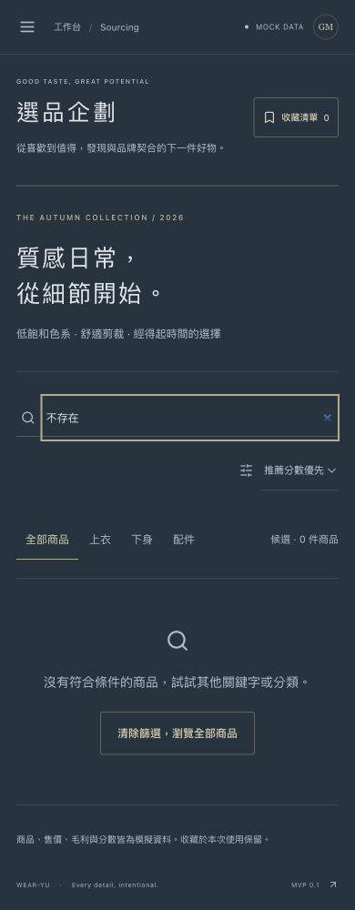
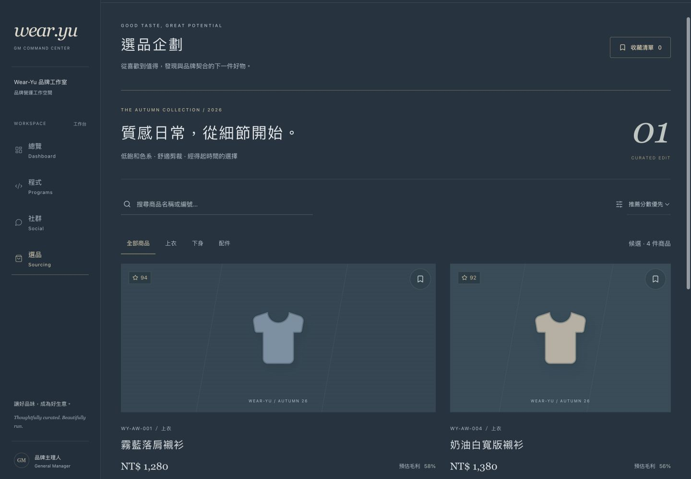

# Wear-Yu 第二輪操作精修

## 實際修改

- 手機選單開啟時鎖定背景捲動，關閉或卸載後還原。
- 點選目前頁面、Escape 關閉或切回桌面尺寸時，避免鍵盤焦點留在隱藏選單。
- 選品空結果新增「清除篩選，瀏覽全部商品」，一次清除搜尋、分類與僅收藏條件，保留收藏資料與排序。
- 空結果改用搜尋圖示，避免成功勾選的錯誤暗示；商品數量以狀態區提供輔助工具回饋。
- 保留第一輪霧面鋼藍、髮絲紋、克制金邊與四頁排版。沒有新增 API、資料庫或後端。

## Build / Test

- Production build 通過。
- 7 項互動測試通過；新增選單焦點／捲動還原與複合篩選復原案例。
- 瀏覽器 390px 實測：選單開啟鎖定捲動，點擊目前頁面後焦點回到開啟按鈕且解除鎖定。
- 瀏覽器空結果復原後顯示 4 件商品、搜尋值清空。
- 四頁於 320、390、768、1024、1440px 的 20 組檢查均無橫向溢位。

## 實際畫面

390×1000 手機空結果與 1440×1000 桌面選品 viewport 截圖：

## 驗收結果與仍存在的問題

- 本輪功能與 RWD 自檢通過；正式驗收仍依「資訊主管 → 視覺主管 → 稽核 → GM」進行，未代替任何主管核准。
- 第一輪完整四頁畫面見 [第一輪成果](../ui-round-1/README.md)。本輪不重新更換已建立的品牌視覺方向。
- 商品造型與業務資料仍為 mock，重新整理恢復初始值。
- 已完成兩輪；後續應依正式驗收的具體缺失處理，不自動啟動第三輪改版。
